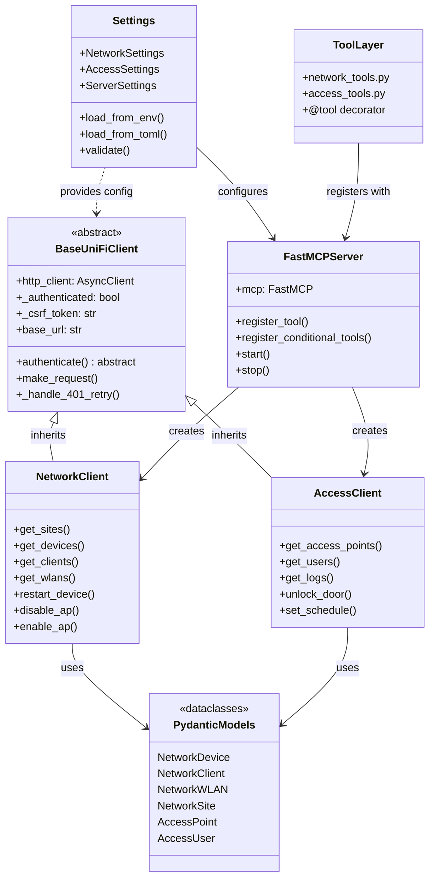
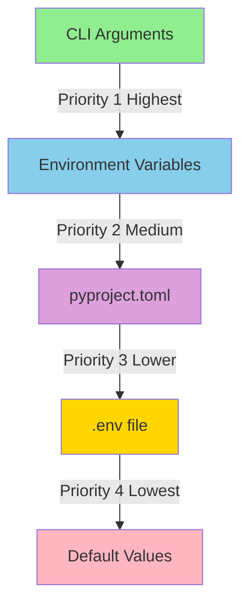
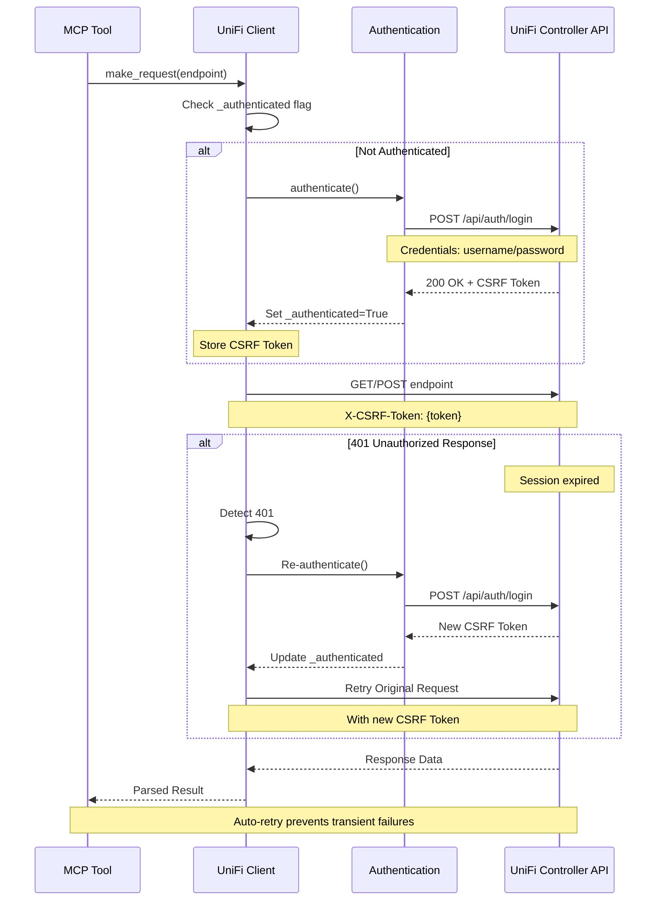
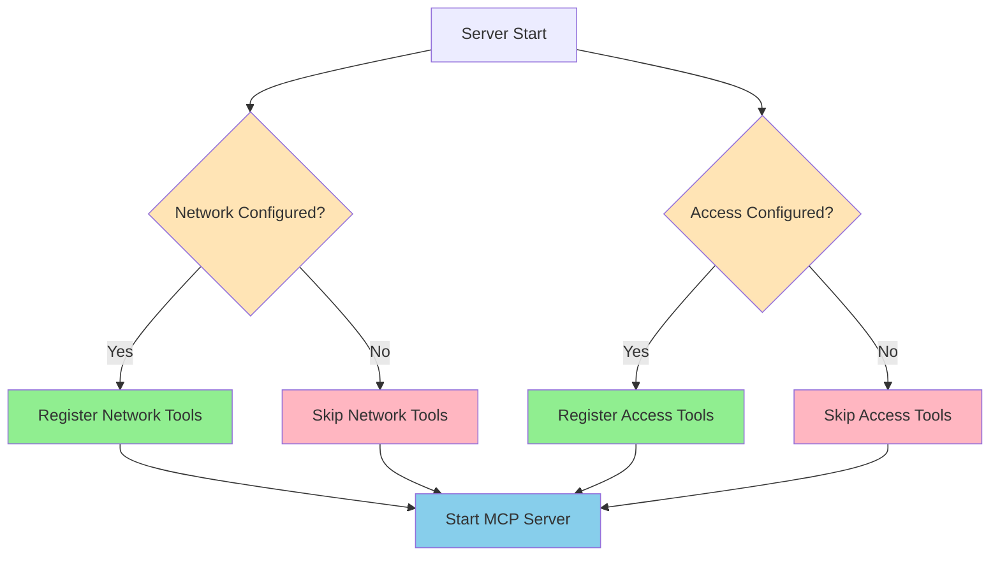

# CLAUDE.md

This file provides guidance to Claude Code (claude.ai/code) when working with code in this repository.

## Project Overview

UniFi MCP Server is a FastMCP-based Model Context Protocol server that provides tools for managing UniFi Network and Access controllers. The server exposes UniFi controller operations as MCP tools, enabling AI assistants to interact with UniFi infrastructure.

## Development Commands

### Package Management

```bash
# Install dependencies using uv (preferred)
pip install uv && uv sync

# Or install with pip
pip install -r requirements.txt

# Install in development mode
pip install -e .
```

### Running the Server

```bash
# Start server via CLI
python -m unifi_mcp start --host 127.0.0.1 --port 8000

# Start with debug mode
python -m unifi_mcp start --host 127.0.0.1 --port 8000 --debug

# Start with auto-reload (for development)
python -m unifi_mcp start --reload

# Or run directly
python -c "from unifi_mcp.main import main; main()"
```

### Configuration & Testing

```bash
# Display current configuration
python -m unifi_mcp config

# Check server status
python -m unifi_mcp status

# Test controller connections
python -m unifi_mcp test-connection network
python -m unifi_mcp test-connection access

# Run tests
python tests/test_unifi_mcp.py
```

## Architecture Overview

### Core Components

**1. Configuration Layer** (`config.py`)

- Pydantic-based settings with environment variable support
- Hierarchical settings: `NetworkSettings`, `AccessSettings`, `LocalSettings` (all inherit from `UniFiSettings`)
- Server settings controlled via `ServerSettings`
- Main `Settings` class aggregates all configuration
- Uses nested environment delimiter `__` (e.g., `UNIFI__NETWORK_CONTROLLER__HOST`)

**2. Client Layer** (`clients/`)



- **BaseUniFiClient**: Abstract base class providing:
  - HTTP client with connection pooling (httpx)
  - Authentication state management
  - CSRF token handling
  - Auto-retry on 401/authentication expiry
  - Async context manager support
- **NetworkClient**: UniFi Network Controller API client
  - Endpoints: sites, devices, clients, WLANs, device management
  - Authentication via `/api/auth/login`
- **AccessClient**: UniFi Access Controller API client
  - Endpoints: access points, users, logs, door controls

**3. MCP Tools Layer** (`tools/`)

- FastMCP `@tool` decorators for each operation
- **network_tools.py**: Network controller operations
  - get_unifi_sites, get_unifi_devices, get_unifi_clients, get_unifi_wlans
  - restart_unifi_device, disable_unifi_ap, enable_unifi_ap
  - get_unifi_statistics
- **access_tools.py**: Access controller operations
  - get_unifi_access_points, get_unifi_access_users, get_unifi_access_logs
  - unlock_unifi_door, set_unifi_access_schedule

**4. Server Layer** (`server.py`)

- FastMCP server initialization and configuration
- Conditional tool registration based on which controllers are configured
- Tools are registered with lambda wrappers to inject client instances
- Server creation separated from server execution for testability

**5. Data Models** (`models/`)

- Pydantic models for UniFi data structures
- `network.py`: NetworkDevice, NetworkClient, NetworkWLAN, NetworkSite
- `access.py`: Access controller models

**6. Utilities** (`utils/`)

- `retry_utils.py`: Retry logic with exponential backoff
- `validators.py`: Input validation helpers

### Configuration Priority



**Priority Order:**

1. CLI arguments (highest priority)
1. Environment variables (prefix: `UNIFI__`)
1. `pyproject.toml` under `[tool.unifi-mcp]` section
1. `.env` file
1. Default values (lowest priority)

### Authentication Flow



**Flow Steps:**

1. Client checks `_authenticated` flag before requests
1. If not authenticated, calls `authenticate()` method
1. Network Controller: POST to `/api/auth/login`, extracts CSRF token
1. Access Controller: Uses controller-specific authentication
1. CSRF token added to subsequent requests via `X-CSRF-Token` header
1. 401 responses trigger re-authentication and request retry

### Tool Registration Pattern



Tools are registered conditionally in `server.py`:

```python
if network_client:
    server.register_tool(
        lambda: get_unifi_sites(network_client),
        name="get_unifi_sites",
        description="...",
    )
```

This pattern allows:

- Server to run with only Network OR Access controller configured
- Client instances injected via closure
- Tools only available when corresponding controller is configured

## Key Design Patterns

1. **Async-First Architecture**: All I/O operations use async/await
1. **Client Abstraction**: BaseUniFiClient provides common HTTP/auth logic
1. **Dependency Injection**: Clients injected into tools via server creation
1. **Configuration Flexibility**: Multiple configuration sources with clear precedence
1. **Error Resilience**: Auto-retry on auth expiry, comprehensive error handling

## Development Notes

- Python 3.13+ required (see `pyproject.toml`)
- All clients use HTTPS (self-signed certs supported via `verify_ssl=False`)
- Default timeouts: 30 seconds (configurable)
- Site ID defaults to "default" across all operations
- MAC addresses used as device identifiers in Network Controller
- FastMCP handles MCP protocol details; focus is on UniFi API implementation

<!-- CRACKERJACK INTEGRATION START -->

This project uses crackerjack for Python project management and quality assurance.

For optimal development experience with this crackerjack - enabled project, use these specialized agents:

- **🏗️ crackerjack-architect**: Expert in crackerjack's modular architecture and Python project management patterns. **Use PROACTIVELY** for all feature development, architectural decisions, and ensuring code follows crackerjack standards from the start.

- **🐍 python-pro**: Modern Python development with type hints, async/await patterns, and clean architecture

- **🧪 pytest-hypothesis-specialist**: Advanced testing patterns, property-based testing, and test optimization

- **🧪 crackerjack-test-specialist**: Advanced testing specialist for complex testing scenarios and coverage optimization

- **🏗️ backend-architect**: System design, API architecture, and service integration patterns

- **🔒 security-auditor**: Security analysis, vulnerability detection, and secure coding practices

```bash

Task tool with subagent_type ="crackerjack-architect" for feature planning


Task tool with subagent_type ="python-pro" for code implementation


Task tool with subagent_type ="pytest-hypothesis-specialist" for test development


Task tool with subagent_type ="security-auditor" for security analysis
```

**💡 Pro Tip**: The crackerjack-architect agent automatically ensures code follows crackerjack patterns from the start, eliminating the need for retrofitting and quality fixes.

This project follows crackerjack's clean code philosophy:

- **EVERY LINE OF CODE IS A LIABILITY**: The best code is no code

- **DRY (Don't Repeat Yourself)**: If you write it twice, you're doing it wrong

- **YAGNI (You Ain't Gonna Need It)**: Build only what's needed NOW

- **KISS (Keep It Simple, Stupid)**: Complexity is the enemy of maintainability

- \*\*Cognitive complexity ≤15 \*\*per function (automatically enforced)

- **Coverage ratchet system**: Never decrease coverage, always improve toward 100%

- **Type annotations required**: All functions must have return type hints

- **Security patterns**: No hardcoded paths, proper temp file handling

- **Python 3.13+ modern patterns**: Use `|` unions, pathlib over os.path

```bash

python -m crackerjack


python -m crackerjack - t


python -m crackerjack - - ai - agent - t


python -m crackerjack - a patch
```

1. **Plan with crackerjack-architect**: Ensure proper architecture from the start
1. **Implement with python-pro**: Follow modern Python patterns
1. **Test comprehensively**: Use pytest-hypothesis-specialist for robust testing
1. **Run quality checks**: `python -m crackerjack -t` before committing
1. **Security review**: Use security-auditor for final validation

- **Use crackerjack-architect agent proactively** for all significant code changes
- **Never reduce test coverage** - the ratchet system only allows improvements
- **Follow crackerjack patterns** - the tools will enforce quality automatically
- **Leverage AI agent auto-fixing** - `python -m crackerjack --ai-agent -t` for autonomous quality fixes

______________________________________________________________________

- This project is enhanced by crackerjack's intelligent Python project management.\*

<!-- CRACKERJACK INTEGRATION END -->
