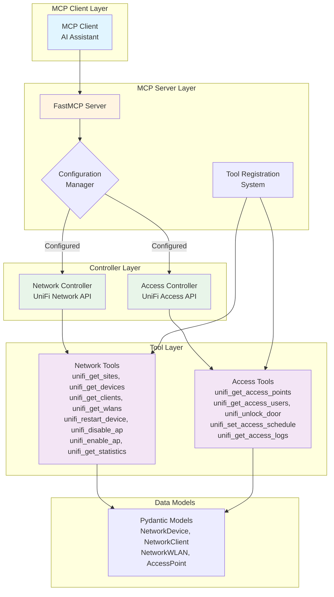

# UniFi MCP Server

[](https://github.com/lesleslie/crackerjack)
[](https://github.com/lesleslie/oneiric)
[](https://github.com/jlowin/fastmcp)
[](https://github.com/astral-sh/uv)
[](https://www.python.org/downloads/)

A FastMCP server for managing UniFi Network and Access controllers.

## Overview

This server provides MCP (Model Context Protocol) tools to interact with UniFi Network and Access controllers, allowing you to manage devices, sites, users, and other UniFi entities through an MCP interface.

### System Architecture



## Features

- **UniFi Network Controller Integration**: Manage sites, devices, clients, and WLANs
- **UniFi Access Controller Integration**: Manage access points, users, and door access
- **MCP Tools**: Rich set of tools for common UniFi operations
- **Configuration Management**: Flexible configuration via environment variables or pyproject.toml
- **Async Operations**: Built with async/await for efficient performance
- **Error Handling**: Comprehensive error handling and retry mechanisms

## Installation

1. Install the required dependencies (the project uses pyproject.toml with uv):

```bash
pip install uv && uv sync
```

2. Install the package in development mode:

```bash
pip install -e .
```

## Configuration

### Environment Variables

You can configure the server using environment variables. The `Settings` class
reads these names directly (no env_prefix is set, so do NOT prefix them with
`UNIFI__` or `MCP_SERVER_` — those names are not bound):

```bash
# Server configuration
HOST=127.0.0.1
PORT=8000
DEBUG=true

# Network Controller (optional)
NETWORK_CONTROLLER__HOST=unifi.example.com
NETWORK_CONTROLLER__PORT=8443
NETWORK_CONTROLLER__USERNAME=admin
NETWORK_CONTROLLER__PASSWORD=<YOUR_PASSWORD_MIN_12_CHARS>  # placeholder — replace
NETWORK_CONTROLLER__SITE_ID=default

# Access Controller (optional)
ACCESS_CONTROLLER__HOST=unifi-access.example.com
ACCESS_CONTROLLER__PORT=8444
ACCESS_CONTROLLER__USERNAME=admin
ACCESS_CONTROLLER__PASSWORD=<YOUR_PASSWORD_MIN_12_CHARS>  # placeholder — replace
ACCESS_CONTROLLER__SITE_ID=default
```

### PyProject.toml Configuration

Alternatively, you can configure the server in your `pyproject.toml` under the
`[tool.unifi-mcp]` section (the canonical section used by the Oneiric CLI
entry point):

```toml
[tool.unifi-mcp]
http_host = "127.0.0.1"
http_port = 3038
enable_http_transport = true
```

## Usage

### Running the Server

The active entry point is `python -m unifi_mcp`, which routes through
`MCPServerCLIFactory`. Run it in the foreground with host/port/debug flags:

```bash
# Foreground (blocks the terminal)
python -m unifi_mcp --host 127.0.0.1 --port 8000

# Or start in the background
python -m unifi_mcp --start-mcp-server --host 127.0.0.1 --port 8000

# Or run via the run_server() entry point
python -c "from unifi_mcp.server import run_server; run_server()"
```

### Available CLI Flags

The Typer CLI in `unifi_mcp/cli.py` exposes top-level lifecycle flags plus
`config` and `test-connection` subcommands, but only the lifecycle flags are
reachable via the documented entry point. The legacy `start`/`status`/subcommand
names shown in older docs are NOT registered against `python -m unifi_mcp`
(which uses `MCPServerCLIFactory`):

```bash
# Start the server in the background (managed by ServerManager)
python -m unifi_mcp --start-mcp-server --host 127.0.0.1 --port 8000 --debug

# Stop / restart / status (use the flag form, not a positional subcommand)
python -m unifi_mcp --stop-mcp-server
python -m unifi_mcp --restart-mcp-server --host 127.0.0.1 --port 8000
python -m unifi_mcp --server-status
```

For connection diagnostics or detailed configuration dumps, use the legacy Typer
entry point directly:

```bash
# Display the resolved Settings
python -m unifi_mcp.cli config

# Test connection to a controller
python -m unifi_mcp.cli test-connection network
python -m unifi_mcp.cli test-connection access
```

## MCP Tools Available

The tools below are the FastMCP-exposed names (the `@server.tool()` decorator
name). Inner helpers in `unifi_mcp/tools/network_tools.py` use the
`get_unifi_*` form, but those are NOT the names clients call — always use the
`unifi_`-prefixed names from the `@server.tool()` wrappers in
`unifi_mcp/server.py`.

### Network Controller Tools

- `unifi_get_sites`: Get all sites from the UniFi Network Controller
- `unifi_get_devices`: Get all devices in a specific site
- `unifi_get_clients`: Get all clients in a specific site
- `unifi_get_wlans`: Get all WLANs in a specific site
- `unifi_restart_device`: Restart a device by its MAC address
- `unifi_disable_ap`: Disable an access point by its MAC address
- `unifi_enable_ap`: Enable an access point by its MAC address
- `unifi_get_statistics`: Get site statistics

### Access Controller Tools

- `unifi_get_access_points`: Get all access points
- `unifi_get_access_users`: Get all users
- `unifi_get_access_logs`: Get door access logs
- `unifi_unlock_door`: Unlock a door
- `unifi_set_access_schedule`: Set access schedule for a user

## Installation via Bodai Marketplace

This repo ships a Bodai Claude Code plugin manifest (`.claude-plugin/plugin.json`) plus a colocated `.mcp.json` and three slash commands in `commands/`. Register the marketplace once via `claude plugin marketplace add /Users/les/Projects/bodai-plugins`, then install with `claude plugin install unifi --marketplace bodai-plugins`. Once installed, the slash commands `/unifi-status`, `/unifi-clients`, and `/unifi-devices` are available alongside the `mcp__unifi__*` tools. The HTTP transport is hardcoded to `http://localhost:3038/mcp`; start the server with `python -m unifi_mcp --host 127.0.0.1 --port 3038` before invoking any of the tools.

## Development

### Running Tests

```bash
# Run the pytest test suite (configured via pyproject.toml [tool.pytest.ini_options])
pytest
# Skip slow tests for fast feedback:
pytest -m "not slow"
```

### Project Structure

```
unifi_mcp/
├── __init__.py
├── __main__.py            # Oneiric CLI entry point (python -m unifi_mcp)
├── cli.py                 # Legacy Typer CLI (reachable as python -m unifi_mcp.cli)
├── server.py              # FastMCP server implementation + @server.tool() registrations
├── config.py              # Configuration management with Pydantic models
├── credentials.py         # macOS Keychain credential resolution
├── main.py                # Convenience entry point
├── clients/               # API clients for UniFi Network, Access, and Local
│   ├── __init__.py
│   ├── base_client.py     # Base HTTP client with authentication handling
│   ├── network_client.py  # UniFi Network Controller API client
│   └── access_client.py   # UniFi Access Controller API client
├── models/                # Pydantic models for UniFi data structures
│   ├── __init__.py
│   ├── network.py         # Network controller data models
│   └── access.py          # Access controller data models
├── tools/                 # Internal helpers used by the FastMCP tool wrappers
│   ├── __init__.py
│   ├── network_tools.py   # Network-specific helpers (get_unifi_*, restart_*, ...)
│   └── access_tools.py    # Access-specific helpers (get_unifi_access_*, unlock_*, ...)
├── utils/                 # Utility functions
│   ├── __init__.py
│   ├── process_utils.py   # ServerManager process lifecycle helpers
│   └── retry_utils.py     # Retry logic with exponential backoff
└── monitoring/            # Reserved for future monitoring/health helpers (currently empty)
```

## Security Considerations

- Store credentials securely and never commit them to version control
- Use appropriate firewall rules to restrict access to the MCP server
- Enable SSL/TLS if the server is exposed to untrusted networks
- Regularly update dependencies to address security vulnerabilities

## Troubleshooting

If you encounter connection issues:

1. Verify that your UniFi controllers are accessible from the server
1. Check that the correct credentials and ports are configured
1. Ensure that SSL certificates are valid (or set `verify_ssl` to false for self-signed certificates in development)
1. Check the server logs for detailed error messages

## Contributing

Contributions are welcome! Please feel free to submit a Pull Request.
